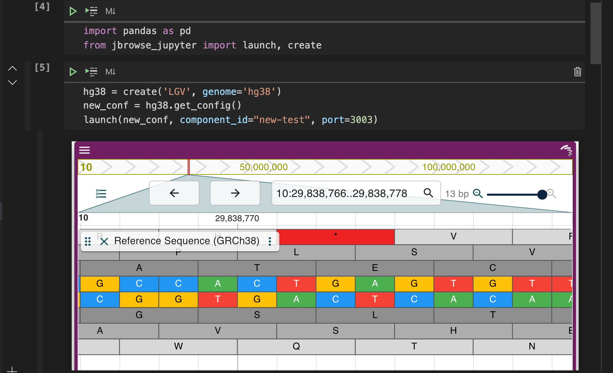

# JBrowse Jupyter

JBrowse Jupyter is a python package that provides a python interface to JBrowse views.

The package provides a JBrowseConfig API to enable the creation of JBrowse views state configuration objects. It also provides utility functions to create and embed Dash JBrowse components in jupyter notebooks and python applications.



*Launching a Linear Genome View in Jupyter Notebook*
## Dash JBrowse
Dash JBrowse is a collection of dash components for JBrowse's embeddable components.

We utilize the Dash JBrowse package along with [jupyter-dash](https://github.com/plotly/jupyter-dash) library to embed [Jbrowse React Linear Genome view](https://www.npmjs.com/package/@jbrowse/react-linear-genome-view) in any jupyter notebook.

You can find more information about our Dash JBrowse library [here](https://github.com/GMOD/dash_jbrowse).
## JBrowseConfig

These configurations can be used to create [Dash JBrowse's Linear Genome View](https://github.com/GMOD/dash_jbrowse) components which can be used in any python application and or jupyter notebook.

The JBrowseConfig API allows us to set an assembly, add tracks, set default sessions, set custom color themes, and more.

For full details please reference the documentation.

## Quickstart
Install the JBrowse Jupyter package using pip
```
$ pip install jbrowse-jupyter
```
*JBrowse Linear Genome view in python Dash application*

```python
import dash
import dash_jbrowse
import dash_html_components as html
from jbrowse_jupyter import create, create_component

app = dash.Dash(__name__)

jbrowse_conf = create("view", genome="hg38")

config = jbrowse_conf.get_config()

component = create_component(config)

app.layout = html.Div(
    [component],
    id='test'
)

if __name__ == "__main__":
    app.run_server(port=8081, debug=True)

```

You can customize the Linear Genome View by modifying the jbrowse_conf. From adding tracks, to setting custom color palettes and more.
<!-- ## Installation

## Developlment
Clone the repository. -->

## Academic Use
This package was written with funding from the [NHGRI](https://genome.gov/) as
part of the JBrowse project. If you use it in an academic project that you
publish, please cite the most recent JBrowse paper, which will be linked from
[jbrowse.org](https://jbrowse.org/).

## Resources
* [JBrowse](https://jbrowse.org/jb2/)
* [JBrowse React Linear Genome View](https://www.npmjs.com/package/@jbrowse/react-linear-genome-view)
* [JBrowse React Linear Genome View Docs](https://jbrowse.org/storybook/lgv/main/?path=/story/getting-started--page)
* [What is Dash?](https://dash.plotly.com/)
* [Dash JBrowse](https://github.com/GMOD/dash_jbrowse)

<!-- ## FAQ
* What is an assembly and how do I configure one?
    - An assembly is
* What is a track and how do I add one to the configuration?
    - A track is
* How do I configure text searching?
    - In order to configure text searching in your Linear Genome View, you must first create a text index. Follow the steps found [here](https://jbrowse.org/jb2/docs/quickstart_cli/#indexing-feature-names-for-searching). Then you must create and add a text search adapter to your config. 
* How do I set a default session?
* How do I set a custom color theme palette to fit with my application? -->

## Contact us

We **really** love talking to our users. Please reach out with any thoughts you have on what we are building!

-   Report a bug or request a feature at
    https://github.com/GMOD/dash_jbrowse/issues/new
-   Join our developers chat at https://gitter.im/GMOD/jbrowse2
-   Send an email to our mailing list at `gmod-ajax@lists.sourceforge.net`
