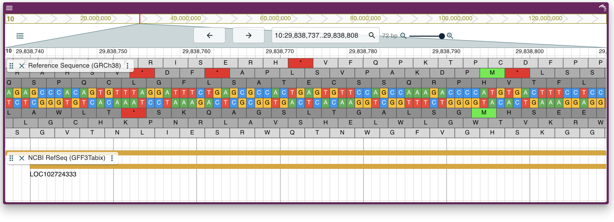

## Quickstart

JBrowse Jupyter is a python package that provides a python interface to JBrowse 2 views.

The package provides a JBrowseConfig API to facilitate the creation of JBrowse 2 React Linear Genome View's state configuration objects. It also provides utility functions to create and embed Dash JBrowse components in jupyter notebooks and python applications.

### Jupyter Notebook
```
$ pip install jupyter-jbrowse
```


*Launching a Linear Genome View in Jupyter Notebook*

### Python Dash Application

```python
import dash
import dash_jbrowse
import dash_html_components as html
from jbrowse_jupyter import create, create_component

app = dash.Dash(__name__)

jbrowse_conf = create("view", genome="hg38")

config = jbrowse_conf.get_config()

component = create_component(config)

app.layout = html.Div(
    [component],
    id='test'
)

if __name__ == "__main__":
    app.run_server(port=8081, debug=True)

```

*Launching a Linear Genome View in python Dash application*
